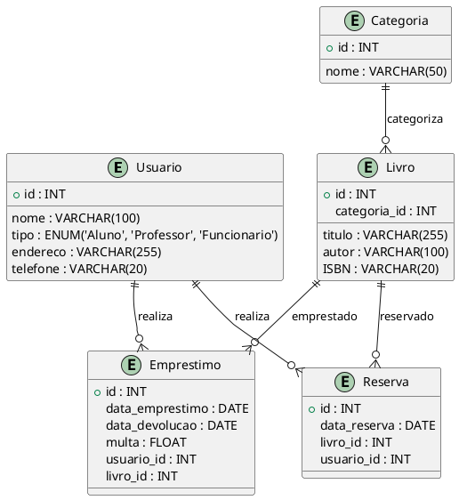

# Sistema de Biblioteca Universitária

Este projeto é um sistema de gerenciamento para uma biblioteca universitária, desenvolvido para atender às necessidades de cadastro, empréstimos, devoluções, reservas de livros e controle de multas. O objetivo é modernizar o sistema de empréstimos, facilitando o acesso a informações e a gestão das operações da biblioteca.

---

## **Conteúdo do Repositório**

- **BibliotecaUniversitaria.sql**: Script SQL contendo a criação do banco de dados, inserção de dados e consultas avançadas.
- **Biblioteca_Logico.puml**: Diagrama lógico do sistema em formato PlantUML.
- **Biblioteca_CasoDeUso.puml**: Diagrama de caso de uso em formato PlantUML.
- **Diagrama Relacional**: Diagrama relacional das tabelas e seus relacionamentos.

---

## **Estrutura do Sistema**

### **Entidades e Atributos**

#### **Usuario**
- `id (PK)`: Identificador único do usuário.
- `nome`: Nome completo do usuário.
- `tipo`: Tipo de usuário (`Aluno`, `Professor`, `Funcionario`).
- `endereco`: Endereço completo do usuário.
- `telefone`: Número de telefone do usuário.

#### **Categoria**
- `id (PK)`: Identificador único da categoria.
- `nome`: Nome da categoria do livro.

#### **Livro**
- `id (PK)`: Identificador único do livro.
- `titulo`: Título do livro.
- `autor`: Nome do autor do livro.
- `ISBN`: Número ISBN do livro.
- `categoria_id (FK)`: Relacionamento com a tabela `Categoria`.

#### **Emprestimo**
- `id (PK)`: Identificador único do empréstimo.
- `data_emprestimo`: Data do empréstimo.
- `data_devolucao`: Data prevista para devolução.
- `multa`: Valor da multa associada (se aplicável).
- `usuario_id (FK)`: Relacionamento com a tabela `Usuario`.
- `livro_id (FK)`: Relacionamento com a tabela `Livro`.

#### **Reserva**
- `id (PK)`: Identificador único da reserva.
- `data_reserva`: Data da reserva.
- `livro_id (FK)`: Relacionamento com a tabela `Livro`.
- `usuario_id (FK)`: Relacionamento com a tabela `Usuario`.

---

## **Diagrama Lógico**

O diagrama lógico do sistema pode ser renderizado a partir do arquivo `Biblioteca_Logico.puml`. Veja uma prévia abaixo:


---

### Diagrama de Caso de Uso
O diagrama de caso de uso pode ser renderizado a partir do arquivo Biblioteca_CasoDeUso.puml. Ele inclui os atores e funcionalidades do sistema, como "Empréstimo de Livro" e "Controle de Multas".

---

## Funcionalidades Implementadas

- **Cadastro**:
  - Cadastro de usuários com tipos diferenciados.
  - Cadastro de livros com categorias específicas.
- **Gestão de Empréstimos**:
  - Registro de empréstimos com datas e controle de devoluções.
  - Cálculo de multas baseado na data de devolução.
- **Gestão de Reservas**:
  - Registro de reservas com status e vínculo ao usuário e livro.
- **Relatórios**:
  - Livros mais emprestados.
  - Reservas ativas por usuário.
  - Controle de multas por usuário.

---

## Diagrama Relacional


---

## Consultas Avançadas (DQL)

### Consultar todos os livros e suas categorias
```sql
SELECT Livro.titulo, Categoria.nome 
FROM Livro 
JOIN Categoria ON Livro.categoria_id = Categoria.id;

```

---

### Consultar empréstimos de um usuário específico
```sql

SELECT Emprestimo.id, Livro.titulo, Emprestimo.data_emprestimo, Emprestimo.data_devolucao 
FROM Emprestimo
JOIN Livro ON Emprestimo.livro_id = Livro.id
WHERE Emprestimo.usuario_id = 1;

```
---

### Consultar usuários com reservas ativas
```sql

SELECT Usuario.nome, Livro.titulo, Reserva.data_reserva
FROM Reserva
JOIN Usuario ON Reserva.usuario_id = Usuario.id
JOIN Livro ON Reserva.livro_id = Livro.id;

```
### Consultar multa acumulada por usuário
```sql
SELECT Usuario.nome, SUM(Emprestimo.multa) AS total_multa
FROM Emprestimo
JOIN Usuario ON Emprestimo.usuario_id = Usuario.id
GROUP BY Usuario.id;
```

---

### Como Usar

Como Renderizar os Diagramas
Faça o download dos arquivos .puml:

Biblioteca_Logico.puml
[Biblioteca_CasoDeUso.puml)
Acesse o PlantUML Online Renderer.

Faça o upload dos arquivos para visualizar os diagramas.


Faça o download ou clone o repositório:

git clone https://github.com/vhvaz/biblioteca-universitaria-sql.git

Importe o arquivo BibliotecaUniversitaria.sql no seu banco de dados MySQL ou MariaDB.

Utilize os exemplos de consultas ou crie suas próprias queries para explorar os dados.

---

### Decisões de Modelagem
Utilizei enum para categorizar tipos de usuários, categorias de livros e status de reservas, garantindo maior controle e padronização.
Chaves estrangeiras foram implementadas para assegurar integridade referencial entre tabelas.
Estrutura simples e funcional para facilitar o entendimento e escalabilidade.

Este projeto foi desenvolvido com o objetivo de fornecer uma solução prática e eficiente para o gerenciamento de bibliotecas universitárias. Todo o sistema foi pensado para atender às demandas mais comuns, permitindo futuras expansões e personalizações. Caso tenha dúvidas ou sugestões, não hesite em entrar em contato!
